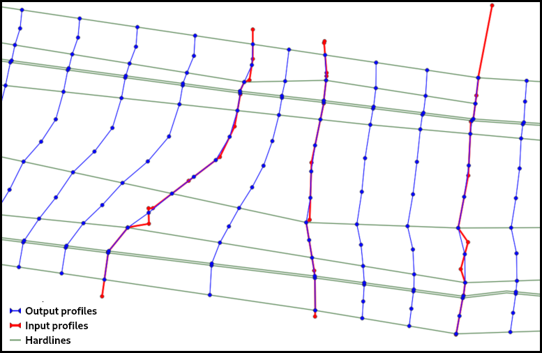
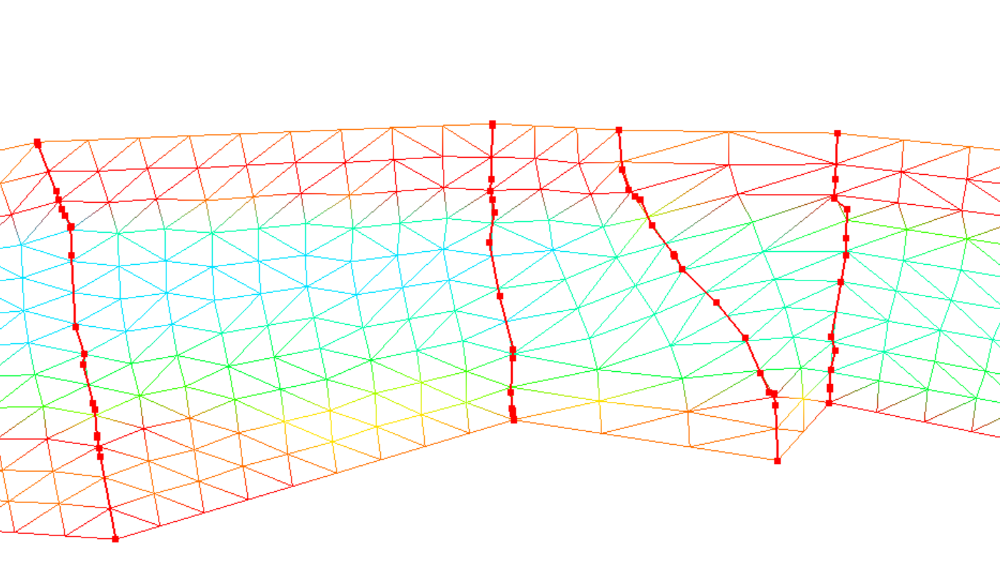
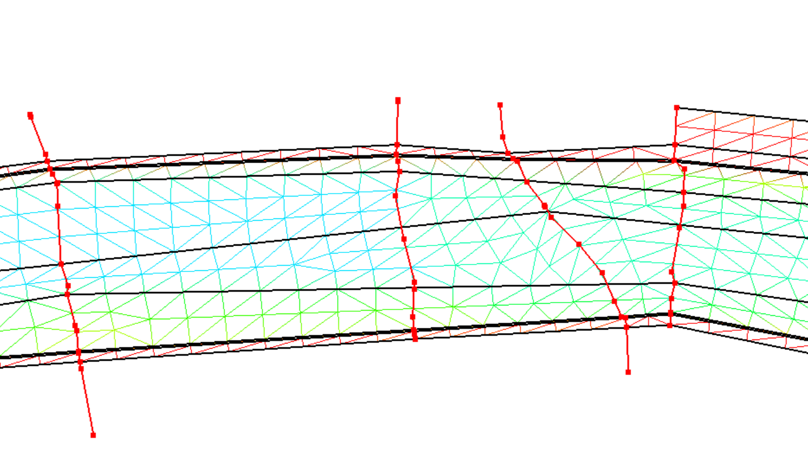

Tatooine Mesher
===============

> Interpolateur linéaire et mailleur à partir de **profils en travers** et de lignes de contraintes

## Description

* **Interpolateur** linéaire à l'aide de lignes directrices 2D :
    * densificateur de profils 1D : ajout de profils intermédiaires interpolés
    * possibilité de
* **Mailleur 2D** : triangulation Delaunay contrainte avec comme :
    * sommets : ceux issus de l'interpolateur
    * arêtes contraintes : celles qui sont le long des profils en travers et des lignes de contraintes

## Pré-requis

**Python 3** avec les **modules** listés dans le fichier [requirements.txt](requirements.txt).

[PyTelTools](https://github.com/CNR-Engineering/PyTelTools) is a dependency that can be installed in another directory
and linked with the `PYTHONPATH` environment variable.
This module is used to read/write some specific file formats of Telemac and BlueKenue tools.

## Formats des fichiers supportés par l'outil

### Fichier de profils en travers

Le tableau suivant compare les informations contenues dans les différents formats de fichiers :

Format        | Extension | Sédiments
--------------|-----------|----------
BlueKenue     | *.i3s     | Non
shp POINTZ    | *_pts.shp | Oui
shp POLYLINEZ | *.shp     | Non
Irstea        | *.ST      | Non

Les couches sédimentaires permettent de décrire les interfaces entre les couches et seul le format "shp POINTZ"
peut contenir ces informations.

### Fichier de profils en travers
* cas des lignes (**i3s**, **shp**, **ST**)
    * les profils ne sont pas nécessairement ordonnées, c'est l'axe hydraulique qui permet de les ré-ordonner
    * tous les profils sont décrits dans le même sens (rive gauche à droite ou inversement)
* cas des points (**_pts.shp**)
    * tous les profils sont décrits dans le même sens (rive gauche à droite ou inversement)

### Fichier de l'axe hydraulique
* les lignes 2D sous fournies dans un des formats : **i2s** ou **shp**
* une seule polyligne orientée de l'amont vers l'aval
* elle intersecte tous les profils (et les épis)
* (l'axe hydraulique n'est pas considéré comme une ligne de contrainte et peut donc intersecter des lignes de contrainte)

### Fichier de lignes de contraintes
* les lignes 2D sous fournies dans un des formats : **i2s** ou **shp**
* les lignes de contraintes ne se croissent pas
* les lignes sont toutes orientées dans le même sens que l'axe hydraulique

### Fichier de maillage
* l'écriture d'un maillage se fait dans les formats : **t3s** (BlueKenue), **LandXML** ou **slf** (Telemac)
* seul le format slf permet d'avoir la description des couches sédimentaires (dans des variables différentes)

## Utilisation

### Principe
Les scripts sont disponibles en *ligne de commande* uniquement.
Pour obtenir l'*aide* de l'outil, utiliser l'argument `-h` en exécutant le script.
Voici un exemple :
```bash
densify_profiles.py -h
```



### Densificateur de profils
Exemple d'utilisation basique :
```bash
densify_profiles.py axe.i2s profils.i3s out.shp --pas_long 6 --pas_trans 4
```

### Interpolateur/mailleur 2D
Exemple d'utilisation basique :
```bash
linear_interpolator_and_mesher.py axe.i2s profils.i3s --pas_long 6 --pas_trans 4 --outfile_semis semis.shp --outfile_mesh maillage.slf
```

Sans lignes de contrainte  | Avec lignes de contrainte
-------------------------- | -------------------------
 | 

### Description des quelques arguments particuliers
Les arguments `attr_profils_travers` et `attr_epis` permettent de définir l'attribut à utiliser pour identifier
respectivement les profils et les épis.
Dans le cas d'un fichier shp, l'attribut doit exister dans le fichier et pour un fichier i3s, il faut saisir `Value`
pour lire la valeura affectée à chaque objet.
Si ces arguments ne sont pas renseignés, les objets sont simplement numéros à partir de 0.

L'outil `linear_interpolator_and_mesher.py` dispose de l'argument `--constant_ech_long` pour spécifier comment les
points intermédiaires (entre 2 profils) sont ajoutés.
Si cet argument est renseigné, l'outil ajoutera un nombre de points constant longitudinalement.
Ainsi les points en sortie correspondront aux profils que le densificateur de profils aurait calculés.

## TODO
* read "lignes contraintes" from ST files
* add option to project per `Lit` for all profiles
* use a logger for message handling
